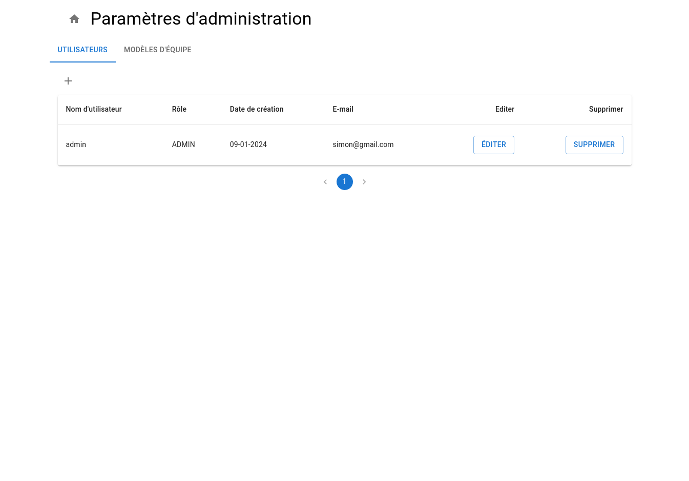

# Lia association webapp
**Lia** is a French association organizing food distributions. It's an anti-waste and social organization.

**Goal of the application:** Allowing association members to subscribe themselves for events, such as food distributions.
## Functionalities:

- User authentication (username and password)
- List, Create, Update, Remove events
- List, Create, Update, Remove users
- List, Create, Update, Remove team templates*
- Subscribe/Unsubscribe to events' teams
- Manage events and users localization. 

Each event contains several teams. A team group people to perform a specific task during an event.

*To make administrators' lives easier, a team is created using a template. Team templates are pre-defined data models with a specific team title, team type, memo text, number of places, (...)

## Preview

### Event:

Mobile version:

### User:

### Team's template:

